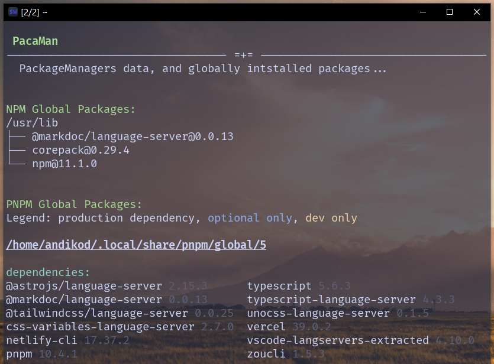
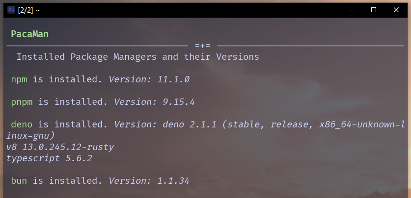

# PacaMan

This BashBox will list all JS PackageManagers installed on the system, their directories and respective  packages they globally installed.

As of now, it checks for NPM, PNPM, Deno or Bun.

```bash
pacaman
```
<p align="center">
    
</p>

```bash
pacaman managers
```
<p align="center">
    
</p>


## Prerequisites

Only [Sh:erpa](https://github.com/SherpaCLI/sherpa) will be needed, as Bash package manager and script builder. Be sure you have curl, git & gawk installed, then run:

```bash
bash -c "$(curl -sLo- https://sherpa-cli.netlify.app/install.sh)"
```

Check [the QuickInstall](https://sherpa-cli.netlify.app/install/install/) page in the documantation.

## Install PacaMan

1. Run the Install command

```bash
s install -n "pacaman" -u "https://github.com/AndiKod/pacaman-bashbox.git"
```

The repo will be cloned, script built from the src/ and be available as `pacaman`. See the documentation about the [sherpa install](https://sherpa-cli.netlify.app/commands/package/install) command.

2. Example usage

Once installed, just type `pacaman` or `pacaman managers` and it will print out the requested informations.

...that's all. Keep doing your stuff as usual, check PacaMan when you need to verifiy things or remember what and where things are installed. Happy hacking!
